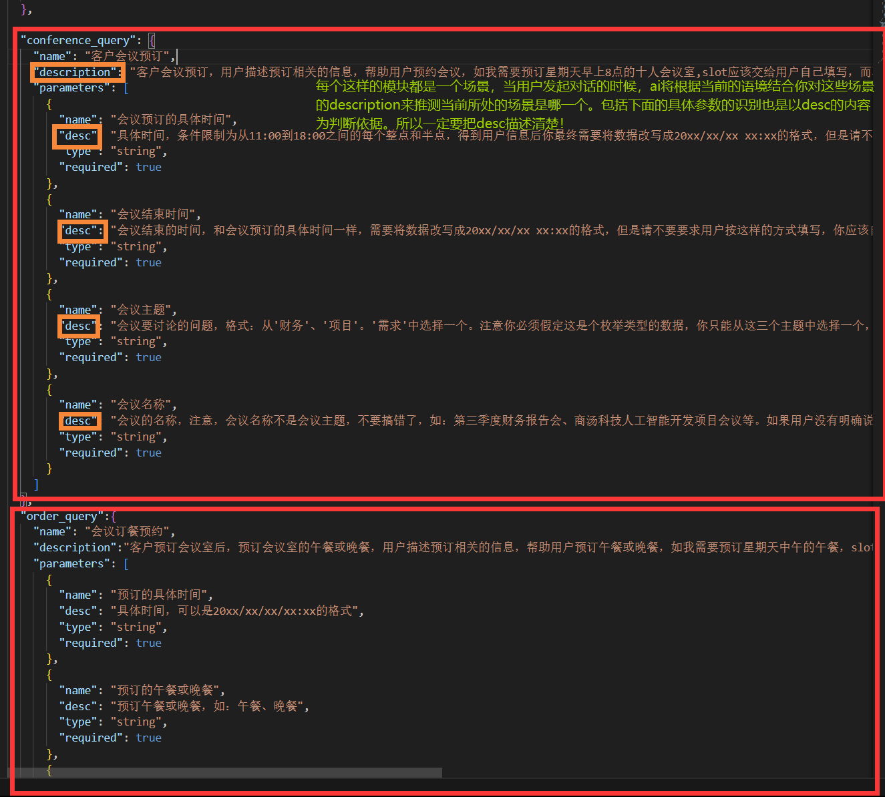

# IntelliQ
## 介绍
IntelliQ 是一个开源项目，旨在提供一个基于大型语言模型（LLM）的多轮问答系统。该系统结合了先进的意图识别和词槽填充（Slot Filling）技术，致力于提升对话系统的理解深度和响应精确度。本项目为开发者社区提供了一个灵活、高效的解决方案，用于构建和优化各类对话型应用。

<Strong>项目源链接：https://github.com/answerlink/IntelliQ</Strong>

## 特性
1. 多轮对话管理：能够处理复杂的对话场景，支持连续多轮交互。
2. 意图识别：准确判定用户输入的意图，支持自定义意图扩展。
3. 词槽填充：动态识别并填充关键信息（如时间、地点、对象等）。
4. 接口槽技术：直接与外部APIs对接，实现数据的实时获取和处理。
5. 自适应学习：不断学习用户交互，优化回答准确性和响应速度。
6. 易于集成：提供了详细的API文档，支持多种编程语言和平台集成。

## api接口调用：
```python
@app.route('/multi_question', methods=['POST'])
def api_multi_question():
    data = request.json
    question = data.get('question')
    if not question:
        return jsonify({"error": "No question provided"}), 400

    response = chatbot_model.process_multi_question(question)
    return jsonify({"answer": response})

@app.route('/update_slots', methods=['POST'])
def api_update_slots():
    data = request.json
    question = data.get('question')
    if not question:
        return jsonify({"error": "No question provided"}), 400

    response = chatbot_model.process_slot_update(question)
    return jsonify(response)
```


## 针对当前集采场景下的chatbot的定制

### 主要自定义模块：
- scene_config\\scene_prompts.py

定义负责填槽的ai基本设定，角色定义和行为约束条件
- scene_config\\scene_templates.py

定义具体的对话场景，通过描述让ai自动识别对应场景来触发填槽任务，引导用户完成对应场景下所有slot的填写

- chatbot_model.py

★★这个文件定义了我们的机器人应该如何通过对话来识别当前所处的场景以及如何进一步调用各种处理模式。这应该是你了解项目的起点

- common_processor.py

★★★这个文件定义ai处理模式，包含读取用户输入和补充词槽的逻辑，这是项目最核心的部分，定义了具体的业务操作逻辑，目前的操作是根据元企会议预约服务的特殊构造。如果有后续需求，可考虑扩展和重写这里的函数，使用策略模式来定义多种类型的processor

### LLM输出处理和数据抽参与整合相关的调整
- utils\\helpers.py

```python
当前场景下基于集采场景的json处理改进
def extract_json_from_string(input_string):
    try:
        # 使用非贪婪匹配改进提取，避免截断嵌套结构
        matches = re.findall(r'\{.*?\}', input_string, re.DOTALL)
        valid_jsons = []
        for match in matches:
            try:
                json_obj = json.loads(match)
                valid_jsons.append(json_obj)
            except json.JSONDecodeError:
                # 尝试使用修复函数
                fixed_json = fix_json(match)
                print(f"try to fix")
                if fixed_json:
                    # 尝试解析修复后的JSON字符串
                    try:
                        fixed_json_obj = json.loads(fixed_json)
                        valid_jsons.append(fixed_json_obj)
                    except json.JSONDecodeError:
                        continue  # 如果修复失败，跳过当前匹配
    except Exception as e:
        print(f"解析错误: {e}")
        return []
    return valid_jsons

def fix_json(llm_output):
    # 修复可能存在的JSON格式问题，例如替换单引号为双引号
    fixed_output = llm_output.replace("'", '"')
    # 尝试解析修复后的JSON字符串
    try:
        json_object = json.loads(fixed_output)
        return json.dumps(json_object)  # 返回修复并解析成功的JSON字符串
    except json.JSONDecodeError as e:
        print(f"解析错误: {e}。在处理字符串: {fixed_output}")
        return None
    
```

-   针对集采清单的格式转换,生成最终well-formed的输出格式以便api调用：
```python
def prepare_json_data_for_api(json_data):
    """
    修改json_data中特定条目的value格式，准备发送给API。
    """
    for item in json_data:
        if item.get("name") == "采购的内容清单":
            current_value = item.get("value", "")
            if isinstance(current_value, str):
                # 预处理，为每个商品数量后插入分隔符"; "
                preprocessed_value = re.sub(r"(\d+)(支|张|台|个|批|对|打|份|盒|箱|)", r"\1\2; ", current_value)
                # 分割处理后的字符串
                items_list = preprocessed_value.split("; ")
                formatted_list = []
                for it in items_list:
                    if it:  # 避免空字符串
                        # 分割物品名称和数量
                        match = re.match(r"(.+?)(\d+)(支|张|台|个|批|对|打|份|盒|箱)", it)
                        if match:
                            item_name = match.group(1).strip()
                            quantity = f"{match.group(2).strip()}{match.group(3).strip()}"  # 包括单位
                            formatted_list.append({"item": item_name, "quantity": quantity})
                item["value"] = formatted_list
            elif isinstance(current_value, list):
                continue  # 已是列表，不处理
            
    return json_data
```
# 修改配置
配置项在 config/__init__.py
GPT_URL: 可修改为OpenAI的代理地址
API_KEY: 修改为ChatGPT的ApiKey

# 启动
```bash
python app.py
```
python app.py

#### 可视化调试可以浏览器打开 demo/user_input.html 或 127.0.0.1:5000

